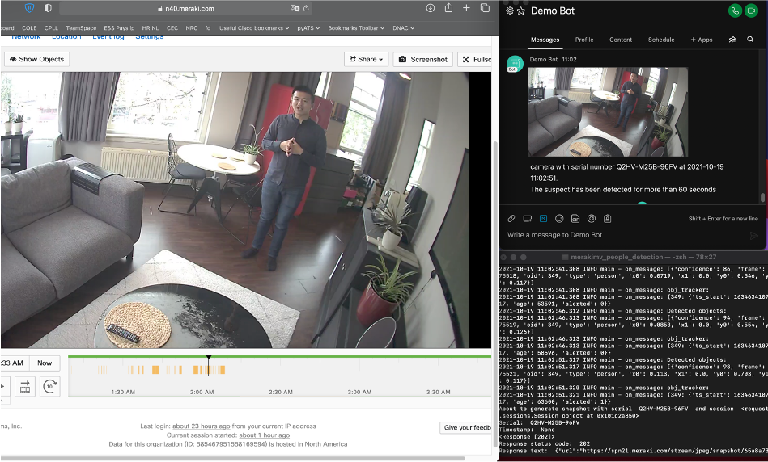
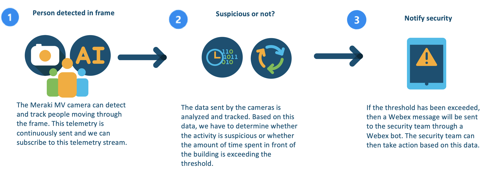
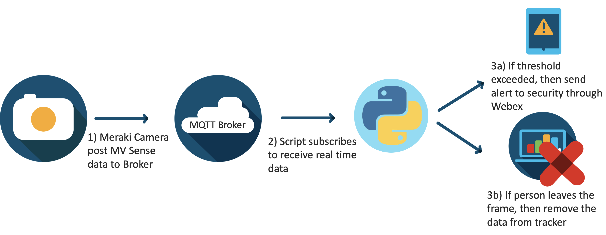

# GVE Devnet Meraki MV People Detection

In this PoV, we have created a script that can subscribe to a Meraki MV telemetry stream through a MQTT broker and it can detect whether a person is loitering for more than a set threshold. In case the person is detected for longer than the set threshold, then a Webex notification is sent to a recipient through a Webex bot.  


## Contacts
* Simon Fang (sifang@cisco.com)
* Eda Akturk  (eakturk@cisco.com)

## Solution Components
*  Python 3.8
*  Meraki MV Camera 
*  Cisco Webex
*  MQTT Broker

## Screenshots


## Flow




## Installation/Configuration

The following commands are executed in the terminal.

1. Create and activate a virtual environment for the project:
   
        #WINDOWS:
        $ py -3 -m venv [add_name_of_virtual_environment_here] 
        $ [add_name_of_virtual_environment_here]/Scripts/activate.bat
        #MAC:
        $ python3 -m venv [add_name_of_virtual_environment_here] 
        $ source [add_name_of_virtual_environment_here]/bin/activate
        

> For more information about virtual environments, please click [here](https://docs.python.org/3/tutorial/venv.html)

2. Access the created virutal environment folder

        $ cd [add_name_of_virtual_environment_here]

3. Clone this repository

        $ git clone [add_link_to_repository_here]

4. Access the folder `merakimv_people_detection`

        $ cd merakimv_people_detection

5. Install the dependencies:

        $ pip install -r requirements.txt


## Setup: 

*Meraki MV Camera Connection*
1. Obtain the Meraki API key and add it to the `env_var.py` file. You can find details on how to obtain the Meraki API key [here.](https://developer.cisco.com/meraki/api-v1/#authorization)
```python
MERAKI_API_KEY= " "
```
2. Add your Network ID and Camera Serial to the `env_var.py` file. 
```python
NETWORK_ID = " "
CAMERA_SERIAL = " "
```
*MQTT Setup*

3. In the Meraki dashboard, go to `Cameras` > `[Camera Name]` > `Settings` > `Sense` page.

4. Click to Add or Edit MQTT Brokers > New MQTT Broker and add you broker information. For testing/trial you can find public broker at [here](https://github.com/mqtt/mqtt.github.io/wiki/public_brokers).

5. Add the MQTT Server settings to the `env_var.py` file.
```python
MQTT_SERVER = " "
MQTT_PORT = None #Please note: integer
```

*Cisco Webex*

In order to send notifications to a Webex space, we have created a Webex Bot. Follow the following instructions to create a Webex bot and its token: 

1. Log in to `developer.webex.com`

2. Click on your avatar and select `My Webex Apps`

3. Click `Create a New App`

4. Click `Create a Bot` to start the wizard

5. Following the instructions of the wizard: fill in details such as the bot name, bot username and choose an icon

6. Click `Add Bot` and you will be given access token

7. Copy the access token and store it safely. Please note that the API key will be shown only once for security purposes. In case you lose the key, then you have to revoke the key and regenerate a new key

> For more information about Webex Bots and how to create one, please see the [documentation](https://developer.webex.com/docs/bots).

8. Add the Webex settings to the `env_var.py` file:

```python
BOT_ACCESS_TOKEN = " "
MESSAGE_RECIPIENT = " " # email address
```

*Threshold settings*

The threshold settings can be configured in `env_var.py` file. The value specified is in milliseconds. By default, the threshold is set at 60000 milliseconds, but in practice 10 minutes is more likely. 

```python
AGE_THRESHOLD = 60000 #milliseconds
```


## Usage: 
Run the python script
```
    $ python main.py
```
When a person is detected the a MQTT broker will send a notification to the python program. If the person stays within the reach of the camera for 5min then a webex notification is sent to the security team. 

### LICENSE

Provided under Cisco Sample Code License, for details see [LICENSE](LICENSE.md)

### CODE_OF_CONDUCT

Our code of conduct is available [here](CODE_OF_CONDUCT.md)

### CONTRIBUTING

See our contributing guidelines [here](CONTRIBUTING.md)

#### DISCLAIMER:
<b>Please note:</b> This script is meant for demo purposes only. All tools/ scripts in this repo are released for use "AS IS" without any warranties of any kind, including, but not limited to their installation, use, or performance. Any use of these scripts and tools is at your own risk. There is no guarantee that they have been through thorough testing in a comparable environment and we are not responsible for any damage or data loss incurred with their use.
You are responsible for reviewing and testing any scripts you run thoroughly before use in any non-testing environment.
